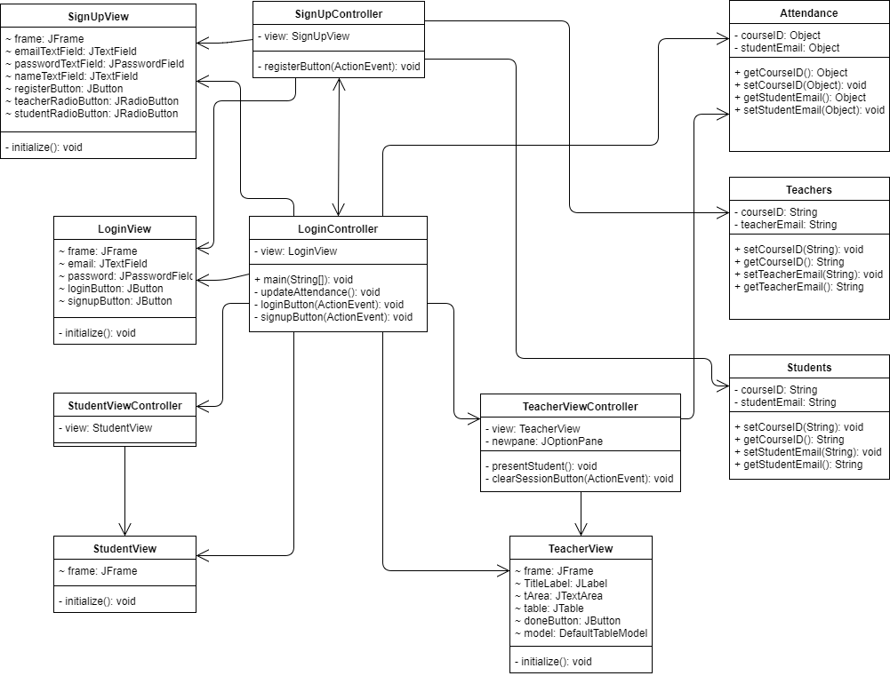

<h1 align="center">
Student Attendance Tracker   System Design
</h1>

## Project Development Team
* Shriram Anpalakan (anpalaka)
* Karan Bhagat (bhagatka)
* Hamza Ali (alihamz2)
* Brandon Villamor (villamo3)
* Mike Byun (byundong)
* Prashant Rawal (rawalpr1)

<h1 align="center">Table of Contents</h1>

[**Report**](#report)

1. [System's Operating Environment](#operating-environment-dependencies)
2. [Error-Handling Strategy](#error-handling-strategy)

[**CRC Cards**](#crc-cards)

3. [SignUpView](#signupview)
4. [SignUpController](#signupcontroller)
5. [LoginView](#loginview)
6. [LoginController](#logincontroller)
7. [TeacherView](#teacherview)
8. [TeacherViewController](#teacherviewcontroller)
9. [StudentView](#studentview)
10. [StudentViewController](#studentviewcontroller)
11. [Attendance](#attendance)
12. [Students](#students)
13. [Teachers](#teachers)

[**System Architecture**](#system-architecture)

14. [UML Class Diagram](#uml-class-diagram)

<h1 align="center">Report</h1>

## Operating Environment Dependencies

* Our application can run on Windows, Mac and Linux OSes with minor GUI differences
* We assume the operating environment has JRE 9+ installed
* We assume the operating environment is connected to the internet to allow for server communication between Backendless and the application

[back to top](#table-of-contents)

## Error-Handling Strategy

For invalid user input, we'll whitelist the input and display an appropriate error message to the user. For example, this is our strategy for handling invalid login and signup inputs.

In the event of a network failure, we'll display an appropriate error message to the user and leave it to the them to either fix the connection failure or close the application.

In the event of multithreading program issues, a server API call overload may occur. In this case, we'll display an appropriate error message to the user to close the application to prevent memory leak since our application can't gracefully recover from these issues.

In the event of an external system failure, we'll leave it to the user to close the application since our application has no way of detecting the external system failure.

[back to top](#table-of-contents)

<h1 align="center">CRC Cards</h1>

## SignUpView 

**Class name:** SignUpView
**Parent class:** N/A
**Subclasses:** N/A
**Responsibilities:**
* Initializes GUI for "Sign Up" page
* Has an email field
* Has a password field
* Has a name field
* Has radio buttons to choose between a teacher or student account
* Has a "Back

**Collaborators:**

[back to top](#table-of-contents)

## SignUpController
**Class name:** SignUpController
**Parent class:** N/A
**Subclasses:** N/A
**Responsibilities:**
* Creates the user account
* Updates the SignUpView
* Updates the database
* Shows appropriate error message when an exception occurs

**Collaborators:**
* SignUpView
* LoginView
* LoginController
* Students
* Teachers

[back to top](#table-of-contents)

## LoginView
**Class name:** LoginView
**Parent class:** N/A
**Subclasses:** N/A
**Responsibilities:**
* Initializes GUI for Login page
* Has a username field
* Has a password field
* Has a "Login" Button
* Has a "Register" button

**Collaborators:**

[back to top](#table-of-contents)

## LoginController
**Class name:** LoginController
**Parent class:** N/A
**Subclasses:** N/A
**Responsibilities:**
* Has a LoginView
* Interprets user input from LoginView
* Validates user input and shows appropriate error messages
* Updates student attendance upon student login

**Collaborators:**
* LoginView
* Attendance
* SignUpView
* SignUpController
* TeacherView
* TeacherViewController
* StudentView
* StudentViewController

[back to top](#table-of-contents)

## TeacherView
**Class name:** TeacherView
**Parent class:** N/A
**Subclasses:** N/A
**Responsibilities:**
* Initialize GUI for Teacher’s home page
* Has an attendance list
* Has a clear session button

**Collaborators:**

[back to top](#table-of-contents)

## TeacherViewController
**Class name:** TeacherViewController
**Parent class:** N/A
**Subclasses:** N/A
**Responsibilities:**
* Has a TeacherView
* Dynamically updates TeacherView's attendance list
* When clear session button is pressed, clears the attendance list
* Sends message to TeacherView as feedback while waiting for a session to clear

**Collaborators:**
* TeacherView
* Attendance

[back to top](#table-of-contents)

## StudentView
**Class name:** TeacherView
**Parent class:** N/A
**Subclasses:** N/A
**Responsibilities:**
* Initialize GUI for Teacher’s home page
* Displays "attendance confirmed" message

**Collaborators:**

[back to top](#table-of-contents)

## StudentViewController
**Class name:** TeacherViewController
**Parent class:** N/A
**Subclasses:** N/A
**Responsibilities:**
* Has a StudentView

**Collaborators:**
* StudentView

[back to top](#table-of-contents)

## Attendance
**Class name:** Attendance
**Parent class:** N/A
**Subclasses:** N/A
**Responsibilities:**
* Represents a student's attendance confirmation entry
* Knows its course ID
* Knows its student email

**Collaborators:**

[back to top](#table-of-contents)

## Students
**Class name:** Students
**Parent class:** N/A
**Subclasses:** N/A
**Responsibilities:**
* Knows its course ID
* Knows its student email

**Collaborators:**

[back to top](#table-of-contents)

## Teachers
**Class name:** Teachers
**Parent class:** N/A
**Subclasses:** N/A
**Responsibilities:**
* Knows its course ID
* Knows its teacher email

**Collaborators:**

[back to top](#table-of-contents)

<h1 align="center">System Architecture</h1>

## UML Class Diagram

[back to top](#table-of-contents)
